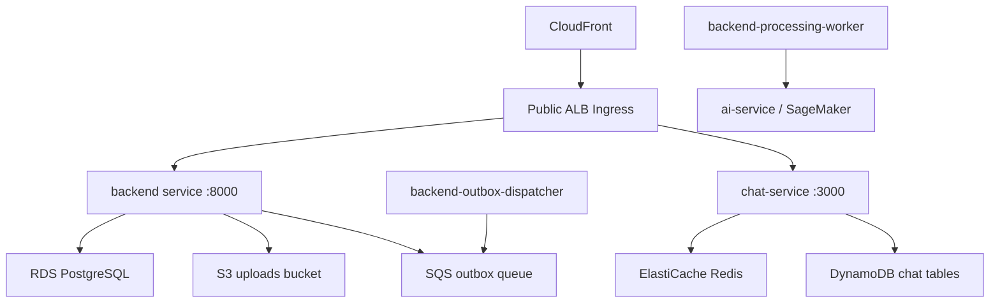

---
title: "Nhật ký tuần 7"
date: 2024-01-01
weight: 7
chapter: false
pre: " <b> 1.7. </b> "
---

# Week 7 - Amazon EKS and Managed AWS Services

## Objectives

Week 7 focused on the production AWS runtime: EKS, managed databases, runtime IAM, SQS outbox transport, public ALB routing, and deployment scripts that apply the Kubernetes workloads safely.

## Tasks Completed

| Status | Task | Evidence basis |
|---|---|---|
| Completed | Added production deployment pipeline logic for EKS, ALB, and CloudFront support. | Commit `899ff3b`. |
| Completed | Added no-domain ALB ingress path for `/api`, `/chat`, and `/socket.io`. | `k8s/eks/ingress-alb-no-domain.yaml`. |
| Completed | Added EKS deployment script behavior for secrets, config, migration/init jobs, rollouts, health checks, and optional AI service. | `scripts/k8s/deploy-eks.sh`. |
| Completed | Added rollout-only workflow mode for existing workloads. | Commits `51bceee` and `f81e086`. |
| Completed | Hardened public ingress deployment around AWS Load Balancer Controller readiness and ALB health checks. | Commits `036a516` and `8272c4a`. |
| Partially completed | Attached AWS console and CLI evidence for RDS, Redis, SQS, EKS, and service account status. | Evidence pending: live AWS screenshots/logs are not stored in the report repo. |

## Technical Implementation

The target production environment is centered on EKS namespace `internship`. Backend and chat are long-running Kubernetes Deployments. PostgreSQL, Redis, DynamoDB, SQS, S3, CloudFront, and SageMaker are managed AWS services outside the cluster.



Runtime variables such as `DATABASE_URL`, `REDIS_URL`, `OUTBOX_QUEUE_URL`, and `AWS_REGION` are treated as deployment inputs or Kubernetes secret/config values. The report does not include their secret values.

## Problems and Solutions

| Problem | Root cause | Resolution | Status |
|---|---|---|---|
| Public ingress needed to work before a custom domain was available. | Domain and certificate readiness can lag behind backend deployment. | Added `ingress-alb-no-domain.yaml` with path-based ALB routing. | Completed |
| AWS Load Balancer Controller may not be ready when ingress is applied. | Webhook endpoints can be unavailable during controller rollout. | Public ingress script waits and retries before applying ingress. | Completed |
| Health checks can fail briefly while target groups converge. | ALB registration and pod readiness are eventually consistent. | Public deploy script retries ALB health checks. | Completed |
| EKS rollout may run with limited permissions. | IAM/RBAC permissions may not allow every optional inspection command. | Rollout script tolerates selected limited-permission cases without hiding actual failures. | Completed |
| Exact live managed-service evidence is missing from report files. | AWS CLI/console artifacts were not supplied locally. | Marked EKS/RDS/Redis/SQS screenshots and logs as pending. | Blocked |

## Testing, Build and Deployment Results

| Area | Result | Evidence |
|---|---|---|
| EKS deployment script | Implemented | `scripts/k8s/deploy-eks.sh` validates required variables, applies resources, waits for jobs, rolls out deployments, and performs health smoke checks through port-forwarding. |
| Public ingress script | Implemented | `scripts/aws/deploy-public-ingress.sh` waits for controller readiness and polls `/api/health/ready` and `/chat/health/ready`. |
| Rollout mode | Implemented | `scripts/aws/rollout-eks-workloads.sh` supports restart/scale behavior for backend, chat, dispatcher, and processing worker. |
| Managed AWS resource proof | Partially completed | `PROJECT_CONTEXT.md` lists current resource names, but screenshots/CLI logs should be attached as evidence. |

## Evidence

### Screenshots

Evidence pending: add screenshots under `/images/worklog/week-07/`, for example:

- `/images/worklog/week-07/eks-cluster.png`
- `/images/worklog/week-07/rds-postgres.png`
- `/images/worklog/week-07/elasticache-redis.png`
- `/images/worklog/week-07/sqs-outbox.png`
- `/images/worklog/week-07/alb-target-groups.png`

### Commits and Pull Requests

| Commit | Description | Evidence | Pull Request |
|---|---|---|---|
| `899ff3b` | Added production AWS deployment pipeline, EKS scripts, ALB no-domain ingress, and CloudFront helper. | [View commit](https://github.com/Temp-orgo/AWS-Internship/commit/899ff3bfd8665f00cdb693cc81e5c48bb099a0b5) | Evidence pending |
| `51bceee` | Added EKS rollout workflow mode. | [View commit](https://github.com/Temp-orgo/AWS-Internship/commit/51bceeed9c436f93f366c4e46b7c8109a03399df) | Evidence pending |
| `f81e086` | Tolerated limited EKS permissions during rollout. | [View commit](https://github.com/Temp-orgo/AWS-Internship/commit/f81e086ae8f0164c089e054b063dfbec95ba6750) | Evidence pending |
| `036a516` | Waited for ALB webhook before public ingress. | [View commit](https://github.com/Temp-orgo/AWS-Internship/commit/036a516acb845c75baeb3eed4d84177a2b58c447) | Evidence pending |
| `8272c4a` | Retried ALB health checks during public deploy. | [View commit](https://github.com/Temp-orgo/AWS-Internship/commit/8272c4ac1efca064f09470fe76da0e162ecc6ef6) | Evidence pending |

### Test Logs

Evidence pending: attach actual output from:

```bash
aws eks describe-cluster --name internship-prod --region ap-southeast-1
aws rds describe-db-instances --db-instance-identifier internship-prod-postgres --region ap-southeast-1
aws elasticache describe-replication-groups --replication-group-id internship-prod-redis --region ap-southeast-1
aws sqs get-queue-attributes --queue-url <OUTBOX_QUEUE_URL> --attribute-names All
kubectl get serviceaccount -n internship
kubectl describe serviceaccount internship-runtime -n internship
```

### Build Logs

Evidence pending: attach EKS deployment workflow logs that show the image tags selected for backend, chat, and optional AI service.

### Deployment Logs

Evidence pending: attach `kubectl rollout status`, `kubectl get pods -n internship`, and ALB health-check output.

## Weekly Results

The AWS deployment path became concrete: EKS hosts backend/chat/workers, ALB exposes API and chat routes, and managed AWS services provide relational data, chat storage, realtime pub/sub, queue transport, object storage, and edge delivery.

## Lessons Learned

Production Kubernetes deployment depends on more than manifests. IAM, controller readiness, target group convergence, network routing, health endpoints, and secret handling must all be validated separately.

## Next Week Plan

Run the full build, push, deploy, frontend, SageMaker, and operational-validation path; then document final completed items, partial items, and cost-control actions.
