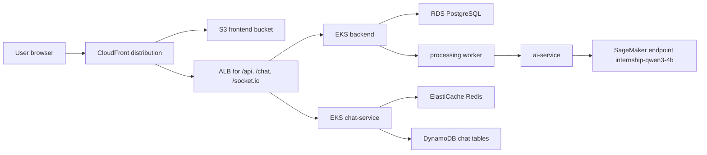

---
title: "Nhật ký tuần 8"
date: 2024-01-01
weight: 8
chapter: false
pre: " <b> 1.8. </b> "
---

# Week 8 - End-to-End Deployment and Operational Validation

## Objectives

Week 8 focused on the final production path: build images, deploy EKS workloads, expose API/chat through ALB and CloudFront, deploy the frontend to S3/CloudFront, integrate the AI service with SageMaker, and document remaining operational evidence gaps.

## Tasks Completed

| Status | Task | Evidence basis |
|---|---|---|
| Completed | Added SageMaker-oriented AI service integration and deployment updates. | Commits `ee542b0` and `019bcf1`; `ai_service/app.py`; `k8s/app/ai-service.yaml`. |
| Completed | Fixed deploy-app image output handling. | Commits `197b6cd` and `351b6ad`. |
| Completed | Fixed chat CI native dependency setup by using local Node headers. | Commit `e245634`. |
| Completed | Documented frontend component architecture. | Commit `af53174`. |
| Completed | Removed Kubernetes frontend resources from the current runtime path so frontend delivery uses S3/CloudFront. | Commit `019bcf1` removed `k8s/app/frontend.yaml` and frontend ingress resources. |
| Partially completed | Attached final end-to-end screenshots, CloudFront proof, image digests, SageMaker status, and cost-control logs. | Evidence pending: runtime screenshots/logs are not stored in the report repo. |

## Technical Implementation

The final deployment model keeps browser-facing static assets on S3/CloudFront and routes API/chat traffic through CloudFront behaviors to the public ALB.



The CI/CD workflow supports deployment modes including `validate`, `deploy-app`, `deploy-public`, `deploy-frontend`, `rollout`, and `full`. Backend/chat/AI images are tagged with `github.sha`. The frontend build uses Vite variables such as `/api` and `/chat` routing, then syncs `frontend/dist` to the private S3 bucket and invalidates CloudFront.

## Problems and Solutions

| Problem | Root cause | Resolution | Status |
|---|---|---|---|
| Deploy-app image outputs could be empty when values were masked by GitHub Actions. | Job outputs containing account/image URIs can be masked or unavailable. | Commits `197b6cd` and `351b6ad` changed the workflow to construct deterministic ECR URIs and verify tags. | Completed |
| Chat CI native module install required Node headers. | Native dependencies can fail during `node-gyp` rebuild if headers are not available. | Commit `e245634` points npm at local toolcache Node headers. | Completed |
| Frontend did not need to run as a Kubernetes workload. | Static frontend hosting is better suited to S3/CloudFront for this architecture. | Kubernetes frontend manifest and frontend ingress resources were removed. | Completed |
| SageMaker integration needed to preserve worker-facing routes. | Existing workers depend on stable AI service HTTP contracts. | AI service acts as an adapter and keeps routes such as `/parse-job`, `/parse-cv`, and `/match-applications`. | Completed |
| Final runtime screenshots and logs are missing from the report repo. | Live AWS evidence was not checked into the Hugo project. | Marked final operational proof as pending. | Blocked |

## Testing, Build and Deployment Results

| Area | Result | Evidence |
|---|---|---|
| Deploy workflow | Implemented | `.github/workflows/cicd.yml` supports validate, deploy-app, deploy-public, deploy-frontend, rollout, and full modes. |
| Backend/chat image selection | Implemented | Workflow constructs ECR image URIs from account, region, repo names, and `github.sha`. |
| Frontend deployment | Implemented | `scripts/ci/deploy-frontend.sh` builds `frontend/dist`, syncs to S3, and invalidates CloudFront. |
| SageMaker AI adapter | Implemented | `ai_service/app.py`, `ai_service/llm/qwen_client.py`, and `k8s/app/ai-service.yaml` contain the SageMaker adapter/deployment path. |
| Lambda notification extension | Partially completed | `PROJECT_CONTEXT.md` documents a Lambda runtime smoke event, but no Lambda handler source file was found in the application repo. |
| End-to-end smoke proof | Partially completed | Health-check scripts exist, but saved final smoke output is pending. |

## Evidence

### Screenshots

Evidence pending: add screenshots under `/images/worklog/week-08/`, for example:

- `/images/worklog/week-08/github-actions-deploy-app.png`
- `/images/worklog/week-08/cloudfront-frontend.png`
- `/images/worklog/week-08/kubectl-get-pods-prod.png`
- `/images/worklog/week-08/sagemaker-endpoint.png`
- `/images/worklog/week-08/e2e-candidate-apply.png`

### Commits and Pull Requests

| Commit | Description | Evidence | Pull Request |
|---|---|---|---|
| `ee542b0` | Enhanced AI service integration with SageMaker and updated deployment scripts. | [View commit](https://github.com/Temp-orgo/AWS-Internship/commit/ee542b0d3e5c743191a5549fe24f456eee1f28d4) | Evidence pending |
| `019bcf1` | Migrated AI direction and removed frontend Kubernetes resources from the runtime path. | [View commit](https://github.com/Temp-orgo/AWS-Internship/commit/019bcf12bcdb51a1eddb8efc83207aaea20846c1) | Evidence pending |
| `197b6cd` | Fixed deploy-app image output handling. | [View commit](https://github.com/Temp-orgo/AWS-Internship/commit/197b6cdea36c804f162fc83c6815c96c494e0bbf) | Evidence pending |
| `351b6ad` | Avoided masked ECR image job outputs. | [View commit](https://github.com/Temp-orgo/AWS-Internship/commit/351b6adfac67c0b72b601f55507010183187a322) | Evidence pending |
| `e245634` | Used local Node headers for chat CI. | [View commit](https://github.com/Temp-orgo/AWS-Internship/commit/e24563432a120b41aad54bc274beda400c21b685) | Evidence pending |
| `af53174` | Added frontend component architecture documentation. | [View commit](https://github.com/Temp-orgo/AWS-Internship/commit/af5317448ea86712de7ba8b4183b6feb7e1644ad) | Evidence pending |

### Test Logs

Evidence pending: attach final CI or local smoke output, for example:

```bash
curl -fsS https://<cloudfront-domain>/api/health/ready
curl -fsS https://<cloudfront-domain>/chat/health/ready
kubectl rollout status deployment/backend -n internship
kubectl rollout status deployment/chat-service -n internship
kubectl rollout status deployment/ai-service -n internship
```

### Build Logs

Evidence pending: attach GitHub Actions logs showing image build/push and frontend `npm run build`.

### Deployment Logs

Evidence pending: attach logs for deploy-app, deploy-public, deploy-frontend, CloudFront invalidation, and SageMaker endpoint status. Do not include secrets, database URLs, or tokens.

## Weekly Results

The final architecture path is implemented in source: backend/chat/workers run on EKS, frontend is delivered through S3/CloudFront, ALB exposes API/chat paths, and the AI service adapts worker calls to SageMaker. The remaining report work is evidence collection: screenshots, CI logs, final health checks, image digests, and cost-control proof.

## Lessons Learned

End-to-end deployment requires separating implemented source changes from verified runtime state. A workflow, script, or manifest proves that a path exists; a CI log, `kubectl` output, AWS CLI response, or screenshot proves that it actually ran.

## Next Week Plan

After Week 8, the next work should be final evidence hardening: collect missing screenshots, export key CI logs, add Cost Explorer or Pricing Calculator evidence, confirm SageMaker and Lambda runtime status, and run the Hugo build before submission.
