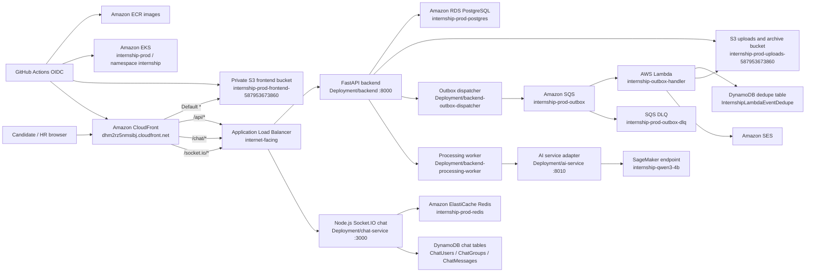

## Internship Application Platform

**An AI-integrated internship application management platform deployed on AWS**

## Project Summary

Internship Application Platform is a centralized platform that helps students, candidates, and companies manage the internship recruitment process in one system.

For Candidates, the system supports profile creation, internship opportunity discovery, application status tracking, CV and document management, direct communication with HR, and AI-based evaluation of the fit between a CV and a Job Description.

For HR teams and companies, the system supports company profile management, job posting, applicant review, recruitment status updates, direct communication with Candidates, and AI-assisted CV analysis, comparison, and ranking.

The project is designed as a multi-service architecture, including:

- A React and Vite frontend.
- A FastAPI REST backend.
- A chat service using Node.js, Socket.IO, Redis, and DynamoDB.
- An AI service for CV analysis, Job Description analysis, and candidate ranking.
- PostgreSQL for business data.
- Amazon S3 for CV and document storage.
- Docker and Kubernetes for standardized deployment environments.
- Observability for metrics, logs, and distributed traces.
- GitHub Actions for CI/CD and security checks.

The production architecture is planned for AWS using Amazon EKS, Amazon ECR, Amazon RDS for PostgreSQL, Amazon DynamoDB, Amazon ElastiCache, Amazon S3, Amazon CloudFront, Application Load Balancer, and suitable monitoring services.

## Problem Statement

### Current Problems

During the internship search process, students often manage application information with spreadsheets, personal notes, email, or several separate platforms. This approach creates several problems:

- Job and company information is scattered.
- It is difficult to track the status of each application.
- CVs, transcripts, certificates, and related documents are stored in multiple places.
- Candidates have limited support for evaluating how well their CV matches a Job Description.
- Communication with HR is not directly connected to the application record.
- Candidates can easily miss deadlines, interview schedules, or document requests.

For HR teams and companies, manual recruitment workflows also create limitations:

- CV reading and classification takes a significant amount of time.
- It is difficult to compare multiple candidates using consistent criteria.
- Recruitment status may not be updated consistently.
- Candidate data may be stored insecurely.
- Communication between HR and Candidates is scattered across multiple channels.
- There is no centralized tool for tracking recruitment activity and effectiveness.

### Proposed Solution

Internship Application Platform provides a centralized system for both Candidates and HR.

Candidates can:

- Register and manage their accounts.
- Update personal profiles.
- Search and view job information.
- Submit applications.
- Track recruitment status.
- Upload and manage CVs, certificates, and transcripts.
- Communicate directly with HR.
- Use AI to analyze CV fit against a job.

HR teams and companies can:

- Create and manage company profiles.
- Post and edit job openings.
- View submitted applications.
- Update candidate recruitment status.
- Communicate directly with Candidates.
- Use AI to extract information, calculate fit scores, and support candidate ranking.

Long-running tasks such as document reading, CV analysis, and reranking are processed asynchronously through workers so that the main API is not blocked during processing.

## Benefits and Value

For Candidates, the platform helps:

- Manage the full application process in one place.
- Reduce the risk of losing documents and job information.
- Track the status of each application clearly.
- Identify relevant skills and missing skills.
- Communicate with companies more conveniently.

For HR teams, the platform helps:

- Reduce manual CV processing time.
- Centralize candidate information and recruitment status.
- Standardize the resume evaluation process.
- Support data-driven decision-making.
- Improve recruitment tracking and coordination.

For the development team, the project provides an opportunity to apply full-stack development, Cloud architecture, AI integration, realtime communication, Kubernetes, CI/CD, observability, and system security knowledge.

## Solution Architecture

The original proposal expected a multi-service AWS architecture with Kubernetes for containerized services, managed databases, object storage, realtime chat, observability, and CI/CD. The final implementation keeps that direction but adjusts two important areas based on deployment evidence:

- The React frontend is no longer a Kubernetes workload. It is built with Vite, stored in a private S3 bucket, and delivered by CloudFront.
- Backend, chat, worker, outbox dispatcher, and the SageMaker adapter remain on EKS because they are long-running processes or need Kubernetes rollout, health check, and scaling controls.

### Final implemented architecture

### Architecture explanation

CloudFront is the single public entry point for users. Static assets use the default CloudFront behavior and are read from the private frontend S3 bucket through CloudFront Origin Access Control. Dynamic API and realtime routes are sent to the public Application Load Balancer:

- `/api/*` is rewritten by the ALB Ingress and routed to the FastAPI backend.
- `/chat/*` is rewritten and routed to the chat service.
- `/socket.io/*` is routed to the chat service for Socket.IO transport.

The EKS cluster hosts only services that need long-running runtime behavior: backend, chat, outbox dispatcher, processing worker, and the AI adapter. PostgreSQL is the transactional database for users, jobs, applications, workflow state, async processing jobs, outbox records, and idempotency records. DynamoDB stores permanent chat entities and Lambda event deduplication state. Redis is used only for Socket.IO pub/sub between chat replicas. SQS decouples committed business events from notification processing, and Lambda performs short event-driven work such as deduplication, S3 archive, and SES email delivery.

### Component responsibility table

| Component | Final responsibility | Implementation evidence |
|---|---|---|
| React/Vite frontend | Candidate and HR user interface, built to static assets | `frontend/package.json`, `scripts/ci/deploy-frontend.sh` |
| CloudFront | HTTPS public entry point and route dispatcher | `scripts/aws/ensure-cloudfront.sh`, supplied distribution `EQIGYNECXDYL8` |
| Frontend S3 bucket | Private storage for `frontend/dist` assets | Supplied bucket `internship-prod-frontend-587953673860` |
| Application Load Balancer | Public routing to EKS services | `k8s/eks/ingress-alb-no-domain.yaml` |
| FastAPI backend | Auth, jobs, applications, uploads, dashboards, processing job APIs | `backend/app/main.py`, backend routers |
| Chat service | REST chat APIs and Socket.IO realtime channel | `chat-service/server.js` |
| Processing worker | Claims asynchronous processing jobs and writes results | `backend/app/workers/processing_worker.py`, `k8s/app/backend-processing-worker.yaml` |
| Outbox dispatcher | Publishes committed PostgreSQL outbox events to SQS | `backend/app/workers/outbox_dispatcher.py`, ADR-001 |
| AI service | Stable worker-facing adapter for SageMaker | `ai_service/app.py`, `k8s/app/ai-service.yaml` |
| RDS PostgreSQL | Transactional business data and reliable worker queues | Alembic migrations through `0008_async_processing_jobs.py` |
| DynamoDB | Chat persistence and Lambda event deduplication | Chat table names in Kubernetes config and supplied runtime context |
| Redis | Socket.IO pub/sub between chat pods | `chat-service/lib/redis.js`, Kubernetes config |
| SQS and DLQ | At-least-once event delivery and failed-message isolation | ADR-001, supplied queue evidence |
| Lambda and SES | Event notification, archive, and email delivery | Supplied runtime smoke-test context |
| GitHub Actions OIDC | CI/CD without long-lived AWS access keys | `.github/workflows/cicd.yml` |

### Design rationale

The frontend was moved from EKS to S3 and CloudFront because it is static after build time. This reduces Kubernetes workload count, removes the need for a frontend Deployment, Service, HPA and PDB, and lets CloudFront handle caching and SPA delivery.

The backend and chat service remain in EKS because they are long-running APIs with health probes, replicas, HPA, PDB, and rolling deployment needs. The processing worker also remains in EKS because CV parsing, job parsing, and matching jobs can run longer than a short Lambda-style task and need queue leases, retries, and controlled concurrency.

The AI service isolates SageMaker-specific inference logic from the worker contract. The worker continues to call stable routes such as `/parse-job`, `/parse-cv`, and `/match-applications`, while the AI adapter handles SageMaker endpoint invocation, timeout, retry, and response normalization.

The transactional outbox is used because committing application data and publishing an event are separate failure domains. Events are first inserted in PostgreSQL in the same transaction as the business mutation. A dispatcher later sends them to SQS. This provides at-least-once delivery, and Lambda uses DynamoDB conditional writes to deduplicate `eventId`.

### Proposal vs final implementation

| Area | Original proposal | Final implemented architecture |
|---|---|---|
| Frontend hosting | Could be served through Kubernetes or AWS static hosting | Implemented as private S3 plus CloudFront |
| Public entry point | ALB and/or CloudFront expected | CloudFront is the user-facing entry point; ALB is an origin for API/chat/socket paths |
| Backend runtime | Kubernetes on EKS | EKS Deployment `backend`, 2 replicas, HPA 2-5 |
| Chat runtime | Node.js and Socket.IO with Redis/DynamoDB | EKS Deployment `chat-service`, 2 replicas, ALB stickiness, Redis pub/sub |
| AI runtime | AI service expected | EKS `ai-service` adapter invokes SageMaker endpoint `internship-qwen3-4b` |
| Event processing | Asynchronous events expected | PostgreSQL outbox, SQS, Lambda, DynamoDB dedupe, S3 archive and SES |
| Deployment | CI/CD expected | GitHub Actions workflow dispatch modes with OIDC and ECR image verification |
| Runtime proof | Design-stage assumption | Runtime evidence supplied for CloudFront, EKS workloads, RDS, Redis, DynamoDB, SQS, Lambda smoke test, and SageMaker endpoint |

### AWS Services Used

| AWS service | Role in the system | Reason for selection |
|---|---|---|
| Amazon EKS | Runs the backend, worker, chat service, and container workloads | Supports Kubernetes, scaling, rolling updates, and multi-service management |
| Amazon ECR | Stores container images | Integrates directly with EKS and GitHub Actions |
| Application Load Balancer | Receives and routes requests to services | Supports routing, health checks, and Kubernetes Ingress integration |
| Amazon RDS for PostgreSQL | Stores users, companies, jobs, applications, document metadata, and processing jobs | Suitable for relational data and transactions |
| Amazon DynamoDB | Stores chat users, conversations, and messages | Suitable for chat data with high read/write traffic |
| Amazon ElastiCache | Provides Redis pub/sub for Socket.IO and temporary data | Helps multiple chat-service instances synchronize events |
| Amazon S3 | Stores CVs, certificates, transcripts, and frontend assets | Provides scalability, high durability, and presigned URL support |
| Amazon CloudFront | Distributes frontend and static assets | Improves access speed and supports HTTPS |
| Amazon SQS | Receives asynchronous events from the outbox dispatcher | Reduces direct coupling between services |
| Amazon SageMaker | Provides an AI inference endpoint in production | Supports managed model endpoints and scalability |
| Amazon CloudWatch | Collects AWS logs, metrics, and alarms | Supports operations and incident investigation |
| AWS IAM | Manages access between workloads and AWS resources | Supports the least privilege principle |

### Component Design

**Frontend**

The frontend is developed with React and Vite and provides interfaces for Candidates and HR. Static files can be built and stored on Amazon S3, then distributed through Amazon CloudFront. The frontend communicates with the backend and chat service through endpoints exposed by the Application Load Balancer.

**Backend API**

The backend is developed with FastAPI and is responsible for user authentication, Candidate and HR management, company and job management, application and document metadata management, presigned URL generation, processing job creation, dashboard data, and business APIs.

**Processing Worker**

The processing worker performs long-running tasks such as CV content extraction, Job Description analysis, CV analysis, matching score calculation, and candidate reranking. Lease, retry, and attempt-limit mechanisms are used to reduce failures when a worker stops during processing.

**Chat Service**

The chat service uses Node.js, Express, and Socket.IO to support realtime communication. DynamoDB stores users, groups, and messages; the Redis adapter synchronizes events across multiple pods; sticky sessions help maintain Socket.IO connections when multiple replicas are running.

**AI Service**

The AI service analyzes CVs and Job Descriptions, converts text into structured data, and supports fit scoring. The AI service should include schema validation, timeout, limited retry, health checks, log control to avoid exposing CV data, and fallback behavior when the model is unavailable.

**Data Storage**

PostgreSQL stores relational data that requires transactions. DynamoDB stores chat data. Amazon S3 stores large files. Redis supports realtime event distribution. Using multiple storage technologies allows each data group to be managed with a technology that matches its access pattern.

**Observability**

The system collects metrics for performance and health monitoring, logs for event and error investigation, and distributed traces to follow requests across services. Prometheus, Grafana, Loki, OpenTelemetry, and Tempo are used in Kubernetes environments; Amazon CloudWatch is used for AWS resource and log monitoring.

## Technical Implementation

### Implementation Phases

| Phase | Main activities |
|---|---|
| 1. Analysis and design | Analyze the Candidate-HR problem, define functional and non-functional requirements, design the database, design the multi-service architecture, and identify required AWS services |
| 2. Business platform foundation | Build authentication, Candidate/HR profiles, company management, job management, application tracking, and document management |
| 3. Realtime and AI integration | Build the chat service, integrate Socket.IO, store chat data in DynamoDB, integrate Redis adapter, build the AI service, analyze CV/JD content, and implement matching and reranking |
| 4. Reliability improvements | Build processing workers, retry, lease, idempotency, optimistic concurrency, transactional outbox, validation, and error handling |
| 5. Containerization and Kubernetes | Write Dockerfiles, build Docker Compose, create a local Kubernetes cluster with kind, deploy Deployment, Service, Ingress, HPA, PDB, health probes, and migration jobs |
| 6. Observability and CI/CD | Collect metrics, logs, and traces, build dashboards, set up alerts, build GitHub Actions, run automated tests, smoke tests, and security scans |
| 7. AWS deployment and completion | Build images, push to Amazon ECR, deploy workloads on Amazon EKS, connect RDS, DynamoDB, ElastiCache, and S3, deploy frontend on S3/CloudFront, run end-to-end tests, and complete the report |

### Technical Requirements

| Component | Technology or requirement |
|---|---|
| Frontend | React, Vite, Tailwind CSS |
| Backend | Python, FastAPI, SQLAlchemy, Alembic |
| Chat service | Node.js, Express, Socket.IO |
| AI service | Python, FastAPI, Qwen-compatible model or SageMaker endpoint |
| Relational database | PostgreSQL |
| Chat database | DynamoDB |
| Cache/pub-sub | Redis or Amazon ElastiCache |
| Object storage | Amazon S3 |
| Containers | Docker |
| Container orchestration | Kubernetes, kind, and Amazon EKS |
| CI/CD | GitHub Actions |
| Monitoring | Prometheus, Grafana, and CloudWatch |
| Logs | Loki and CloudWatch Logs |
| Tracing | OpenTelemetry and Tempo |
| Security | JWT, IAM Role, OIDC, least privilege, and secret management |

## Timeline and Milestones

The plan is adjusted to 8 weeks, from 08/06/2026 to 30/07/2026, to stay consistent with the Worklog section of the report.

| Week | Time | Milestone | Expected deliverable |
|---|---|---|---|
| 1 | 08/06/2026 - 14/06/2026 | Requirements analysis, architecture, backend foundation, and authentication | Project scope, high-level architecture, registration, login, and initial migration |
| 2 | 15/06/2026 - 21/06/2026 | Candidate-HR platform, applications, documents, and S3 | Company, jobs, application flow, secure upload, and document download |
| 3 | 22/06/2026 - 28/06/2026 | Frontend and REST API integration | Candidate/HR interfaces, protected routes, and API integration |
| 4 | 29/06/2026 - 05/07/2026 | Realtime chat | Realtime communication between Candidate and HR using Socket.IO, Redis, and DynamoDB |
| 5 | 06/07/2026 - 12/07/2026 | AI integration and reliable processing | CV/JD analysis, matching, worker, idempotency, concurrency, and outbox |
| 6 | 13/07/2026 - 19/07/2026 | Docker Compose | Full stack runs locally with smoke test procedure |
| 7 | 20/07/2026 - 26/07/2026 | Kubernetes and observability | System runs on kind with metrics, logs, traces, and alerts |
| 8 | 27/07/2026 - 30/07/2026 | CI/CD, AWS, and reporting | End-to-end testing, AWS deployment preparation, and completed documentation |

## Budget Estimation

Exact monthly cost must be calculated with AWS Pricing Calculator or current billing data for account `587953673860` in region `ap-southeast-1`. This proposal therefore records the cost method and known configuration instead of inventing prices.

### Cost assumptions

| Area | Assumption used for estimation | Evidence status |
|---|---|---|
| Environment | Production environment in `ap-southeast-1` | Verified from supplied context and workflow defaults |
| Public traffic | CloudFront distribution `EQIGYNECXDYL8` fronts all browser traffic | Verified from supplied context |
| Frontend | Static assets in S3 bucket `internship-prod-frontend-587953673860` | Verified from supplied context and deploy script |
| Kubernetes | EKS cluster `internship-prod`, namespace `internship` | Verified from supplied context and workflow |
| Backend/chat | 2 replicas each, HPA min 2/max 5 | Verified from manifests |
| Worker/dispatcher | Dispatcher 1 replica; processing worker can be disabled until AI is ready | Verified from manifests and deploy script |
| AI | SageMaker endpoint `internship-qwen3-4b` | Verified from supplied context |
| SQS | Main queue `internship-prod-outbox`, DLQ `internship-prod-outbox-dlq` | Verified from supplied runtime context; repository provisioning script still defaults to older queue names |
| Lambda | `internship-outbox-handler` consumes SQS and sends SES email | Verified from supplied runtime context |

### Cost-estimation methodology

1. Open AWS Pricing Calculator for `ap-southeast-1`.
2. Add each production service in the table below.
3. Enter the real deployed configuration: instance type, storage size, request count, data transfer, retention period, and runtime hours.
4. Export the Pricing Calculator estimate and attach it as evidence before replacing `Pricing evidence required`.
5. Compare with AWS Cost Explorer after the environment has run for a representative period.

| Service | Known configuration or input required | Cost field |
|---|---|---|
| Amazon EKS | One production cluster, `internship-prod` | Pricing evidence required |
| EC2 worker nodes | Managed node group instance type, node count, EBS volumes, runtime hours | Pricing evidence required |
| NAT Gateway | Private subnet egress, NAT hourly charge and processed data | Pricing evidence required |
| Amazon ECR | Backend, chat, and AI images tagged by Git SHA | Pricing evidence required |
| Amazon RDS PostgreSQL | Instance class, allocated storage, Multi-AZ status, backup retention | Pricing evidence required |
| Amazon ElastiCache Redis | Replication group `internship-prod-redis`, node type and node count required | Pricing evidence required |
| Amazon DynamoDB | ChatUsers, ChatGroups, ChatMessages, InternshipLambdaEventDedupe capacity mode and request volume | Pricing evidence required |
| Amazon S3 | Frontend assets, uploads, event archive, storage GB, PUT/GET volume, lifecycle policy | Pricing evidence required |
| Amazon CloudFront | Requests, regional data transfer, invalidations beyond free tier if any | Pricing evidence required |
| Application Load Balancer | One internet-facing ALB, LCU usage and runtime hours | Pricing evidence required |
| Amazon SQS | Standard queue and DLQ request volume, retention, SSE | Pricing evidence required |
| AWS Lambda | SQS-triggered `internship-outbox-handler`, invocations, memory, duration | Pricing evidence required |
| Amazon SES | Email send volume and region-specific SES pricing | Pricing evidence required |
| Amazon SageMaker | Real-time endpoint instance type and uptime for `internship-qwen3-4b` | Pricing evidence required |
| Amazon CloudWatch | Log ingestion, storage retention, metrics, alarms | Pricing evidence required |
| Data transfer | CloudFront egress, NAT processing, ALB traffic, inter-AZ traffic if applicable | Pricing evidence required |
| Total | Sum exported from AWS Pricing Calculator | Pricing evidence required |

The largest likely cost drivers are the EKS control plane, EC2 worker nodes, NAT Gateway, RDS, Redis, ALB, CloudFront data transfer, and especially the SageMaker real-time endpoint. If the SageMaker endpoint uses GPU-backed instances and remains online continuously, AI uptime may dominate the total monthly cost.

### Cost Optimization

- Run the production environment only when demoing or testing.
- Use instance types that match the actual workload.
- Limit the number of worker nodes.
- Stop or delete SageMaker endpoints when not in use.
- Configure suitable log retention.
- Delete old images in ECR.
- Apply S3 lifecycle policies when appropriate.
- Use DynamoDB on-demand while traffic is still unstable.
- Configure AWS Budget and Billing Alarm.
- Delete unused Load Balancers, public IPv4 addresses, snapshots, and volumes.
- Avoid creating a NAT Gateway if the workshop architecture does not require it.

## Risk Assessment

### Risk Matrix

| Risk | Likelihood | Impact | Severity |
|---|---|---|---|
| Secret or AWS credential exposure | Low | Very high | High |
| RDS or services become public unnecessarily | Medium | High | High |
| CV and personal data are accessed without permission | Low | Very high | High |
| AI returns inaccurate results | Medium | Medium | Medium |
| AI service runs out of resources or times out | Medium | High | High |
| Realtime chat disconnects when scaled | Medium | Medium | Medium |
| Worker processes duplicate jobs | Medium | High | High |
| Database updates encounter race conditions | Medium | High | High |
| Kubernetes pod or node failure | Medium | Medium | Medium |
| AWS cost exceeds expectations | Medium | High | High |
| CI/CD deployment fails | Medium | Medium | Medium |
| Third-party package has a vulnerability | Medium | High | High |

### Mitigation Measures

**Security**

- Use IAM Roles and least privilege.
- Do not store AWS Access Keys in source code.
- Use GitHub Actions OIDC.
- Keep `.env`, private keys, and secrets out of the repository.
- Keep S3 buckets private.
- Use presigned URLs with expiration.
- Do not log full CV content or tokens.
- Check authorization and object ownership in the backend.

**Reliability**

- Use readiness and liveness probes.
- Use HPA to support scaling.
- Use PDB to reduce disruption during maintenance.
- Use limited retry.
- Apply processing-job leases.
- Use idempotency keys.
- Apply optimistic concurrency.
- Use transactional outbox for events.

**AI**

- Validate output with schemas.
- Set timeouts.
- Limit retries.
- Allow human review before recruitment decisions.
- Do not use AI scores as the only hiring decision.
- Record reasons or contributing factors when possible.

**Cost**

- Configure AWS Budget.
- Monitor Cost Explorer.
- Delete resources after the workshop.
- Limit AI endpoint runtime.
- Use suitable log retention.
- Check for remaining EBS volumes, Elastic IPs, Load Balancers, and snapshots.

### Contingency Plan

- If EKS is not ready, use Docker Compose or local Kubernetes for the demo.
- If the AI model is unavailable, use mock responses or deterministic scoring to continue testing the business flow.
- If Redis is unavailable, run a single chat-service instance for the demo environment.
- If S3 cannot be accessed, use local storage in development.
- If a worker fails, processing jobs are retried with lease and attempt limits.
- If a new deployment fails, roll back to the previous container image or Kubernetes revision.
- If cost exceeds the limit, stop non-essential workloads and delete high-cost resources.

## Expected Outcomes

After completion, the system is expected to achieve the following outcomes:

- Provide a centralized platform for Candidates and HR.
- Manage companies, jobs, applications, and documents.
- Store CVs and documents securely.
- Support realtime chat.
- Support AI analysis for CVs and Job Descriptions.
- Process long-running tasks with workers.
- Control repeated requests and concurrent updates.
- Run with Docker Compose and Kubernetes.
- Provide a CI/CD pipeline.
- Provide metrics, logs, traces, and alerts.
- Provide an AWS deployment architecture.
- Provide documentation for deployment, testing, and cleanup.

### Long-Term Value

The project can continue evolving into a more complete system with:

- Email or notification when application status changes.
- Interview scheduling.
- AI-generated cover letters.
- Interview questions generated from CVs and Job Descriptions.
- Job recommendations based on Candidate profiles.
- Recruitment analytics dashboard.
- Calendar and email integration.
- Improved explainability for AI matching.
- Mobile application support.
- Expansion to multiple universities and companies.

Beyond product value, the project also provides a reference for building a Cloud-native multi-service system with AI integration, realtime communication, asynchronous processing, Kubernetes, observability, and CI/CD.
